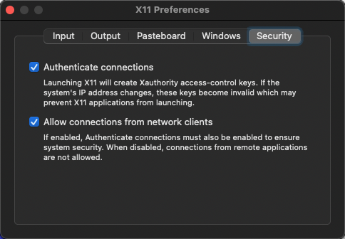

## TLDR

* Install XQuartz `brew install --cask xquartz`, reboot
* `xhost +localhost` to enable XClients to connect to XServer over local TCP/IP connections
* `docker run -it --rm --env="DISPLAY=host.docker.internal:0" ...`

## Motivation

There are numerous examples how to run [X-Window](https://en.wikipedia.org/wiki/X_Window_System) applications in a docker container, but very few of the examples work on macOS using "Docker for Mac" product.
I discovered that trying to work through the tutorials of [ROS2 (Robot Operating System)](https://docs.ros.org/en/foxy/index.html) on my Mac (Big Sur, M1 CPU).
While most of ROS processes work perfectly well in docker, some essential GUI applications such as rqt and rviz need to connect to XServer process running on the host machine.
What follows is a list of steps to make this setup work using "Docker for Mac" and XQuartz.

## Install XQuartz

The first step is to install XQuartz application, which implements X11 system on macOS. 
You can either [download dmg from here](https://www.xquartz.org/) or install XQuartz using Homebrew (my preferred method). 
Please note that Homebrew has changed the command to install "cask" packaged apps, and the correct command to install is available at https://formulae.brew.sh/cask/xquartz#default

```bash
brew update # optional
brew install --cask xquartz
```

After the installation completes, start XQuartz application, select Preferences menu, go to the “Security” tab and make sure you’ve got 
“Allow connections from network clients” checked:



After that **quit and restart XQuartz application**. 
In fact, I had to restart my machine after which things started magically working, so it may or may not be a factor. 
A quick test of XQuartz is to run `xeyes` from the command line, and you should see a pair of googly eyes watching the position of the mouse.

### Permissions control with xhost command

There are several mechanisms to manage access control of an X server - [xhost and xauth](https://tldp.org/HOWTO/Remote-X-Apps-6.html).
`xhost` is a simple mechanism to have an IP based access control, and it's good enough for non-production use. 
Note that the access control settings set by `xhost` will only persist while XQuartz application is running.
Restarting XQuartz application resets the access control to the most restrictive mode (equivalent to `xhost -` with no authorized clients), 
and it's a good idea to quit XQuartz in the end.

Quick reference for working with [xhost](https://linux.die.net/man/1/xhost):

- `xhost` prints the current mode and the list of authorized clients
- `xhost +` disables access control and allows any client from the network to connect to XServer.
- `xhost -` enables access control and allows only authorized clients to connect
- `xhost +localhost` adds localhost to the list of authorized clients, allowing only local processes to connect

For our purpose it sufficient to run `xhost +localhost` to allow docker process to connect to XQuartz XServer.

## Run Docker

Theoretically, all we need to do is to share `/tmp/.X11-unix` directory to allow X11 apps inside a container to communicate with the XServer on the host using Unix Domain Sockets (UDS). 
This approach is described in multiple articles available on this topic, just search for "how to run GUI/X11 apps in docker". 

Unfortunately this approach will not work when using "Docker for Mac". 
There is a [long-standing issue](https://github.com/docker/for-mac/issues/483) for [Docker for Mac](https://docs.docker.com/docker-for-mac/install/) 
that makes Unix style sockets non-functional between the host and a container. 
That issue is related to docker's `osxfs` filesystem driver implementation, and was closed with 'will not fix' resolution.
The Docker Desktop 2.4.0.0 release [switched from `osxfs` to gRPC-FUSE](https://docs.docker.com/docker-for-mac/release-notes/#docker-desktop-community-2400) file sharing driver.
However, after a quick test, I confirmed the issue has not been fixed in the gRPC-FUSE implementation either. 

The workaround for this issue is to use TCP sockets for the XSystem communication instead of Unix Domain Sockets. 
It is [not as](ttps://blog.myhro.info/2017/01/benchmarking-ip-and-unix-domain-sockets-for-real) [performant](https://blog.myhro.info/2017/01/benchmarking-ip-and-unix-domain-sockets-for-real) 
as connecting over UDS, but XSystem was designed to work over the network.
The only trick to make this work is to set `DISPLAY` environment variable inside the container to point at the host display, 
which is addressable as [`host.docker.internal:0`](https://docs.docker.com/docker-for-mac/networking/).

## Quick test

With the following Dockerfile 
```Dockerfile
FROM ubuntu:focal

RUN apt-get update \
    && apt-get install -y --no-install-recommends \
        x11-apps

CMD ["xeyes"]
```

Build it `docker build -t x11-apps .` and run it 
```bash
docker run -it --rm --env="DISPLAY=host.docker.internal:0" x11-apps xeyes
```

If you got the following output, you probably need to start/restart XQuartz, start it now with `xhost +localhost`.
```
No protocol specified
Error: Can't open display: host.docker.internal:0
```
Right now this Dockerfile installs only x11-apps, but you would need to install the actual packages you want to use to the image.

One outstanding issue here is GPU support: for the apps requesting GPU context (e.g. rviz for ROS) I have not gotten this to work. 
If you have an idea how to approach that, let me know in the comments.

### See also
* [http://wiki.ros.org/docker/Tutorials/GUI](http://wiki.ros.org/docker/Tutorials/GUI) - Linux centric, does not work on Mac
* https://github.com/mviereck/x11docker - only supports Linux and Windows hosts, not Macs
